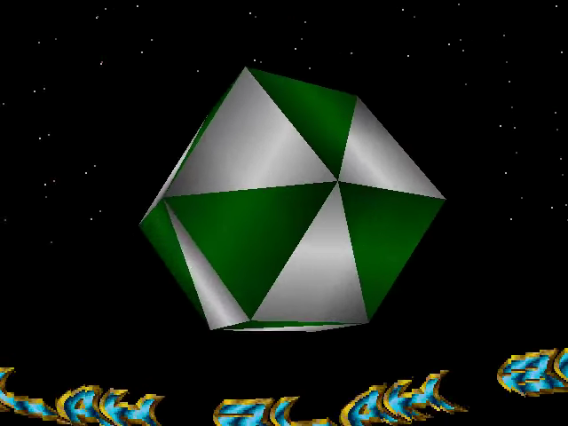
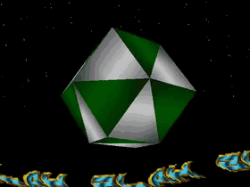

# DMA 3D

Démo Glenz vectors écrite en Go avec Ebitengine et `ym-player`. Le flux YM est
synthétisé directement en PCM stéréo 16 bits à 48 kHz, sans allocation pendant
les lectures audio.

<!-- Project showcase -->
## Screenshots

[](docs/media/screenshot-1.png)

A rotating green-and-white polyhedron above the curved scroller and starfield.

## Video

[](https://github.com/olivierh59500/dma-3d/raw/refs/heads/main/docs/media/preview.mp4)

**[Watch or download the 24-second MP4 preview with sound](https://github.com/olivierh59500/dma-3d/raw/refs/heads/main/docs/media/preview.mp4)**

This preview is captured from the Go production.

The animated image is silent; the MP4 includes the soundtrack.

<!-- End project showcase -->

## Version ordinateur

```sh
go run ./cmd/dma3d
```

## Pixel / Android

Avec un unique appareil Android autorisé et connecté en USB :

```sh
./scripts/run-android.sh
```

Le script génère l’AAR Ebitengine pour `arm64-v8a`, construit l’APK de
débogage, l’installe puis lance `com.olivierh.dma3d/.MainActivity`.

Les détails de la mise à jour du synthétiseur et du passage à 48 kHz se
trouvent dans
[`GUIDE_MIGRATION_YM_PLAYER_48KHZ.md`](GUIDE_MIGRATION_YM_PLAYER_48KHZ.md).

## Vérifications Go

```sh
go test ./...
go vet ./...
```

## Optional DCK version

The original implementation remains at its original paths. Run it with `go run ./cmd/dma3d`.

The construction-kit version is in [dck/](dck/README.md). Run `go run ./dck/cmd/dma3d` from this directory. Both versions share the original assets.
